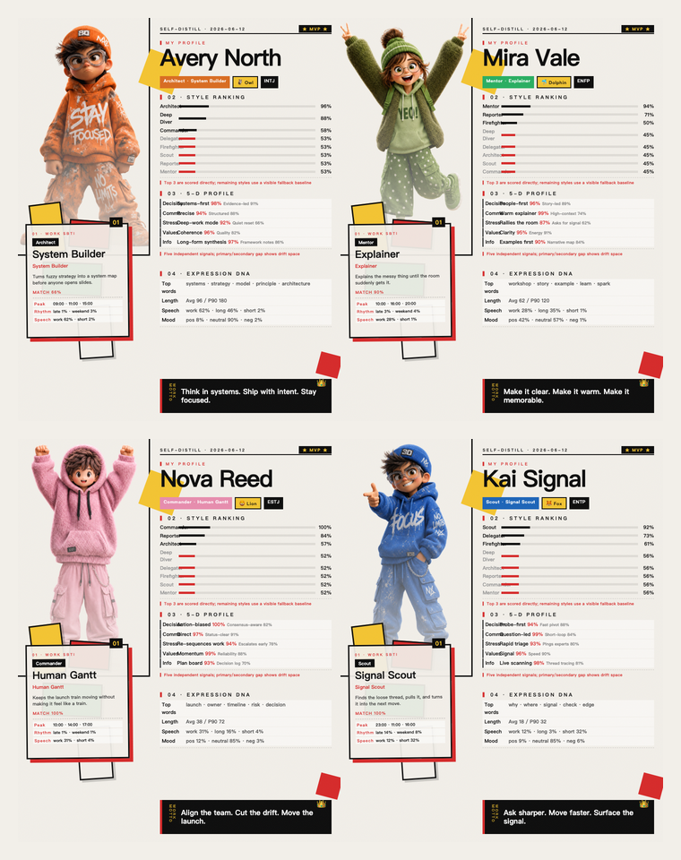

# WorkSelfie

> Not a selfie of your face. A selfie of how you work.

[中文 README](README.md)



You know that feeling when your work chat says more about you than any personality test?

Maybe you are the person who turns messy threads into action lists. Maybe you are the one who explains everything clearly. Maybe you quietly scan group chats, catch weak signals, and jump in when something is about to break.

WorkSelfie lets an agent read the work traces you approve, then turns them into two things: a playful self-analysis report and a shareable 4:5 workplace selfie card.

It is not a questionnaire. It is not another productivity dashboard. It feels more like a friend looking at how you work and saying:

> "You are not just doing tasks. You are playing a very specific workplace character."

## What You Get

- A shareable workplace selfie card with a 3D figure, SBTI ranking, expression DNA, and five-dimension personality signals.
- A full written report explaining why the card looks this way, instead of dropping a random label on you.
- A reusable agent skill that can run again for another person, another team, or another slice of work traces.

## The Figure Means Something

WorkSelfie does not pick a random cute character. It matches visible behavior signals to the figure:

- **Orange Focus**: long messages, abstract language, system thinking, deep work energy.
- **Green Energy**: positive tone, teaching-style explanations, warm group communication.
- **Pink Execution**: steady daytime momentum, clear ownership, strong collaboration center.
- **Blue Scout**: short replies, many questions, fast response, group-channel signal scanning.

The card is not decoration. It is your work style translated into a visual character.

## How To Use It

Put this repository into the skills folder of the agent you use. It is not limited to Codex; any agent that supports local `SKILL.md` / skills folders can use the same pattern.

```bash
git clone https://github.com/Ryder-MHumble/work-selfie.git

# Example: copy it into your agent skills folder
mkdir -p ~/.agents/skills
cp -R work-selfie ~/.agents/skills/work-selfie
```

If your agent uses another skills directory, replace `~/.agents/skills` with that path. For example:

```bash
cp -R work-selfie ~/.codex/skills/work-selfie
cp -R work-selfie ~/.claude/skills/work-selfie
```

Restart your agent and say:

```text
Use WorkSelfie to take a selfie of how I work.
```

The agent should first explain what data it wants to read, wait for your confirmation, and save the result locally by default.

## Just Want The Demo?

You can regenerate the fictional demo cards without connecting real work data:

```bash
cd work-selfie
python3 scripts/generate_demo_cards.py
```

The grid image will be generated at:

```text
examples/cards/demo-grid.png
```

## Who It Is For

- People who want a fun, shareable snapshot of their work style.
- Teams that want a lighter way to understand collaboration styles.
- Agent builders who want to give their assistant a "read me back to myself" capability.
- Anyone who wants boring work traces to become something memorable.

## One-Line Pitch

**WorkSelfie turns your work traces into a shareable workplace selfie card and self-analysis report.**

