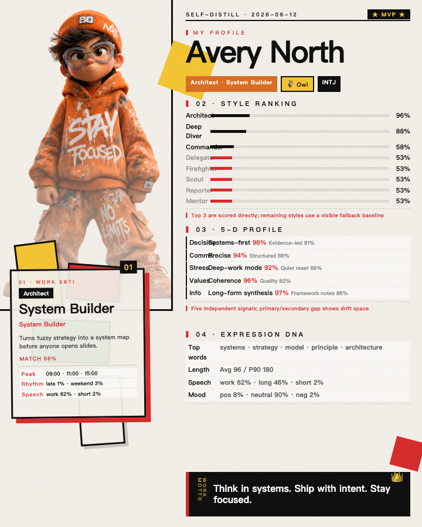
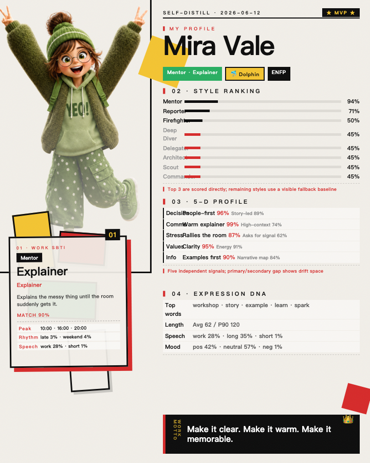
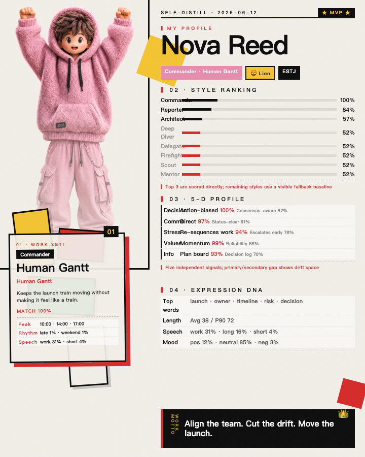
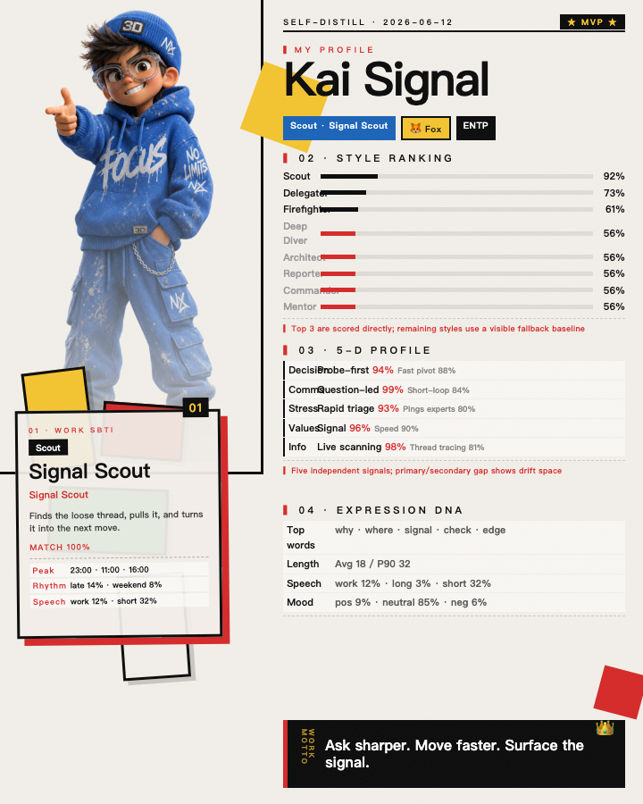

# Self-Distill 自我蒸馏

把你的工作痕迹，变成一张有趣、可分享、但默认隐私安全的「自我画像卡」。

[English README](README.en.md)

Self-Distill 是一个 Codex Skill：它通过 `dws` 读取你自己的钉钉工作信号，在本地分析表达习惯、行为模式和协作节奏，并生成两类产物：

- 一份完整的 Markdown 自我分析报告，覆盖表达 DNA、行为模式、SBTI、MBTI、动物画像和 5 维趣味推断。
- 一张野兽派 × 二次元风格的 4:5 Profile Card PNG，看起来更像收藏角色卡，而不是普通仪表盘。

> 下面的示例卡片全部使用虚构英文人物，不包含任何真实用户数据。

## 示例效果


单张示例：

| 小人 | 示例卡片 | 触发特征 |
|---|---|---|
| 专注橙 |  | 长文本、抽象词、工作词占比高、深度分析明显。 |
| 元气绿 |  | 积极语气、讲解型表达、群聊气氛带动强。 |
| 推进粉 |  | 白天稳定推进、目标明确、核心协作强、项目节奏感明显。 |
| 侦察蓝 |  | 问句多、短回复多、群聊侦察、快速响应或深夜救火。 |

## 它能做什么

Self-Distill 会把普通的工作元数据转成更有表达力的个人画像：

1. **采集**：通过 `dws` 读取你自己的钉钉工作信号。
2. **分析**：提取表达 DNA、活跃时段、消息长度、协作形态、SBTI 风格、MBTI 维度、动物隐喻和 5 维人格信号。
3. **报告**：生成完整 Markdown 分析报告。
4. **出图**：用 HTML/CSS + Headless Chrome 渲染 720×900 PNG 卡片。
5. **交付**：默认本地输出到 `~/Downloads/`；发送到钉钉需要显式开启。

## 隐私模型

Self-Distill 默认本地优先：

- 原始消息和文档正文只在内存中处理，不写入 skill 目录。
- 持久化状态只允许写分析摘要：`data/last_snapshot.json`。
- 报告和 PNG 默认保存到本地。
- 发送到钉钉需要显式参数和二次确认。
- 分发包不应包含任何个人 `data/last_snapshot.json`。

## 快速开始

把文件夹安装为 Codex Skill：

```bash
mkdir -p ~/.codex/skills
cp -R self-distill-skill ~/.codex/skills/self-distill
```

然后重启 Codex，让 Skill 生效。

本地 dry run：

```bash
python3 ~/.codex/skills/self-distill/scripts/main.py --days 90 --skip-consent --dry-run
```

生成本地报告和卡片，不发送钉钉：

```bash
python3 ~/.codex/skills/self-distill/scripts/main.py --days 90 --skip-consent
```

可选：把报告文档和卡片发送回自己的钉钉：

```bash
python3 ~/.codex/skills/self-distill/scripts/main.py --days 90 --skip-consent --send
```

## 自然语言触发词

在 Codex 里可以直接说：

- `自查`
- `蒸馏自己`
- `看看我自己`
- `我是谁`
- `我的野兽派名片`

## 重新生成示例卡片

README 里的示例卡片都是虚构数据。可以这样重新生成：

```bash
cd ~/.codex/skills/self-distill
python3 scripts/generate_demo_cards.py
```

输出文件：

```text
examples/cards/orange-focus-architect.png
examples/cards/green-energy-mentor.png
examples/cards/pink-execution-commander.png
examples/cards/blue-scout-signal.png
examples/cards/demo-grid.png
```

## 3D 小人选择规则

卡片不会随机选小人，而是用用户的表达与行为信号去匹配每个小人的视觉气质：

| 小人 | 文件 | 信号模式 |
|---|---|---|
| 专注橙 | `assets/toonhub-1.png` | 长消息、抽象/系统词、工作词占比高、深度专注。 |
| 元气绿 | `assets/toonhub-2.png` | 积极语气、解释型表达、讲解能量、温暖群聊沟通。 |
| 推进粉 | `assets/toonhub-3.png` | 稳定白天活跃、项目 ownership、核心协作强、推进感强。 |
| 侦察蓝 | `assets/toonhub-4.png` | 问句多、短回复多、群聊侦察、深夜快速响应。 |

实现位置：

```text
scripts/render_card.py
  FIGURE_LIBRARY
  select_figure()
```

测试位置：

```text
scripts/test_render_card_layout.py
```

## 环境要求

- macOS，并安装 Google Chrome：`/Applications/Google Chrome.app/Contents/MacOS/Google Chrome`
- Python 3.10+
- 已配置可用的 `dws` CLI，用于钉钉数据采集
- 仅生成 Demo 卡片时，不需要钉钉权限

## 项目结构

```text
self-distill/
├── SKILL.md
├── README.md
├── README.en.md
├── assets/
│   ├── toonhub-1.png
│   ├── toonhub-2.png
│   ├── toonhub-3.png
│   └── toonhub-4.png
├── examples/
│   └── cards/
├── references/
│   ├── persona-library-spec.md
│   ├── card-style-guide.md
│   └── ...
└── scripts/
    ├── main.py
    ├── analyze.py
    ├── render_card.py
    ├── generate_demo_cards.py
    └── test_render_card_layout.py
```

## 验证方式

运行布局与渲染测试：

```bash
cd ~/.codex/skills/self-distill/scripts
python3 -m unittest test_render_card_layout.py -v
python3 -m py_compile render_card.py
```

预期结果：

```text
Ran 10 tests
OK
```

## 设计定位

Self-Distill 不是严肃人格测试，也不是企业 KPI 仪表盘。它更像一面「工作风格镜子」：

- 足够数据化，所以有依据。
- 足够视觉化，所以能传播。
- 足够怪，所以有记忆点。
- 默认本地优先，所以更安全。
